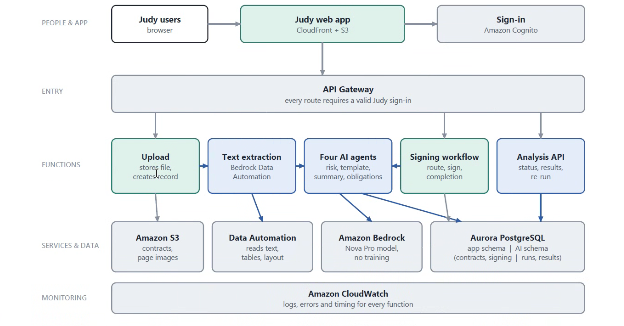

# Judy.ai Knowledge Base - Technical Documentation V2

## Table of Contents

1. [Solution Architecture](#solution-architecture)
2. [Component Descriptions](#component-descriptions)
3. [Agentic RAG Pipeline](#agentic-rag-pipeline)
4. [Document Extraction Pipeline](#document-extraction-pipeline)
5. [Data Flows](#data-flows)
6. [Database Schema](#database-schema)
7. [Configuration](#configuration)
8. [Architectural Decisions](#architectural-decisions)
9. [Terraform & Source Code Structure](#terraform--source-code-structure)
10. [DevOps: Deployment & Maintenance](#devops-deployment--maintenance)
11. [Post-Deployment: Knowledge Base Setup with Default Data](#post-deployment-knowledge-base-setup-with-default-data)

---

## Solution Architecture


---

## Component Descriptions

### Frontend

| Component | Technology | Purpose |
|-----------|------------|---------|
| Static Website | HTML/CSS/JS | Judy.ai branded SPA with upload, chat, files, and review pages |
| Authentication | Cognito Hosted UI (classic) | OAuth2 implicit flow; access/ID tokens valid 1 hour, refresh token 30 days; admin-created users only (no self-signup); MFA disabled |
| Hosting | CloudFront + S3 | CDN delivery with Origin Access Control |

### API Layer

| Component | Technology | Purpose |
|-----------|------------|---------|
| API Gateway | HTTP API (API GW v2) | Routes with Cognito JWT authorizer, CORS configured |
| All routes | Cognito JWT required | All routes require authentication (`authRequired: true`) |

**Full Route Table** (from `IaC/7_apigateway/config/prod.yaml`):

| Method | Path | Lambda | Purpose |
|--------|------|--------|---------|
| POST | `/upload` | `data-upload` | Generate presigned S3 URL |
| POST | `/chat` | `retrieve-and-generate` | Agentic RAG query |
| GET | `/files` | `data-processor` | List uploaded documents |
| GET | `/files/{documentId}/download` | `data-processor` | Get presigned download URL |
| DELETE | `/files/{documentId}` | `data-processor` | Delete document |
| POST | `/contracts/{contractId}/route` | `signature-workflow` | Route contract for signature |
| GET | `/contracts/{contractId}/signers` | `signature-workflow` | List signers for a contract |
| POST | `/contracts/{contractId}/sign` | `signature-workflow` | Record a signature event |
| POST | `/contracts/{contractId}/cancel-routing` | `signature-workflow` | Cancel routing |
| POST | `/contracts/{contractId}/analysis` | `analysis-api` | Trigger AI analysis |
| GET | `/contracts/{contractId}/analysis` | `analysis-api` | Get all analysis results |
| GET | `/contracts/{contractId}/analysis/{agentType}` | `analysis-api` | Get analysis by agent type |
| GET | `/admin/templates` | `admin-api` | List approval templates |
| PUT | `/admin/templates/{templateId}` | `admin-api` | Update approval template |
| GET | `/admin/settings` | `admin-api` | Get system settings |
| PUT | `/admin/settings` | `admin-api` | Save system settings |

### Compute (Lambda Functions)

| Function | Runtime | Timeout | Memory | Purpose |
|----------|---------|---------|--------|---------|
| data_upload | Python 3.13 | 30s | 128MB | Generates presigned S3 URLs, writes initial DynamoDB + Aurora metadata |
| data_processor | Python 3.13 | 60s | 128MB | Handles SQS ingestion events; list/delete files API; creates EventBridge schedules |
| retrieve_and_generate | Python 3.13 | 120s | 512MB | Agentic RAG pipeline (Strands Agents SDK + Bedrock KB) |
| ingestion_post_processor | Python 3.13 | 30s | 128MB | Monitors ingestion jobs, updates DynamoDB status, handles orphan documents |
| document_extraction | Python 3.13 | 300s | 256MB | Invokes BDA on uploaded PDFs; stores extraction results in Aurora; triggers agent pipeline |
| agent_risk_clause | Python 3.13 | 300s | 512MB | AI agent — analyzes contract risk clauses, writes to `judy_ai.*` |
| agent_template_prepopulation | Python 3.13 | 300s | 512MB | AI agent — detects contract template type, pre-populates fields from BDA output |
| agent_summary | Python 3.13 | 300s | 512MB | AI agent — generates contract summaries, writes to `judy_ai.*` |
| agent_obligation_tracking | Python 3.13 | 300s | 512MB | AI agent — extracts and tracks contractual obligations |
| signature_workflow | Python 3.13 | 30s | 128MB | Manages document routing for signature, triggers obligation agent on completion; sends SES emails |
| analysis_api | Python 3.13 | 29s | 256MB | API handler for contract analysis results; invokes agent functions |
| admin_api | Python 3.13 | 29s | 256MB | Admin panel API — manages approval templates and system settings via `app.*` schema |

**Lambda Layer** (retrieve_and_generate only):
- Strands Agents SDK: `arn:aws:lambda:us-west-2:856699698935:layer:strands-agents-py3_13-x86_64:2`

### Data Storage

| Component | Technology | Purpose |
|-----------|------------|---------|
| S3 Landing Zone | Standard bucket (regional) | Raw document storage (PDF/DOCX uploads) + BDA output (`bda-output/` prefix) |
| DynamoDB | PAY_PER_REQUEST | Document metadata (id, name, kb_status, ingestion_job_id, uploader, size) |
| Aurora Serverless v2 | PostgreSQL 17.5 + pgvector | Three schemas: `bedrock_integration` (vector store), `judy_ai` (AI analysis results), `app` (application data) |
| Secrets Manager | JSON secrets | Aurora master credentials; `judy_ai_writer` credentials; `app_writer` credentials |
| SSM Parameter Store | Standard parameters | KB ID, DS ID, Aurora cluster ARN, KMS key ARNs, Secrets Manager ARNs |

### AI/ML

| Component | Model | Purpose |
|-----------|-------|---------|
| Bedrock Knowledge Base | — | Orchestrates ingestion (OCR via BDA, chunking, embedding) and retrieval |
| Embedding Model | Cohere Embed Multilingual v3 | Generates 1024-dim vectors for documents |
| Foundation Model | `us.amazon.nova-pro-v1:0` (cross-region inference profile) | RAG generation and agent reasoning |
| Intent Detection | Amazon Nova Lite v1 | Content safety classification in the RAG pipeline |
| Retrieval Agent | Amazon Nova Lite v1 | KB search with rephrase retry logic |
| BDA Parser | Bedrock Data Automation | Multi-modal document parsing for `document_extraction` Lambda |

> **Note**: The deployment uses cross-region inference profiles (`us.amazon.nova-pro-v1:0`, `us.data-automation-v1`) rather than direct model IDs. This enables automatic failover across AWS regions.

### Event-Driven Components

| Component | Purpose |
|-----------|---------|
| SQS: `ingestion` queue | Buffers S3 ObjectCreated events for the `data_processor` Lambda |
| SQS: `document-extraction` queue | Buffers events for the `document_extraction` Lambda |
| SQS Dead Letter Queues | Capture failed messages after max retries |
| EventBridge Scheduler | Dynamic per-job schedules (1-min rate) to monitor Bedrock KB ingestion jobs |
| CloudWatch Alarm | Alerts when DLQ has messages (processing failures) |
| SES | Email delivery for signature workflow notifications |
| SNS | Fan-out: S3 ObjectCreated event → SNS topic → 2 SQS queues (`ingestion` and `document-extraction`) |

---

## Agentic RAG Pipeline

The `retrieve_and_generate` Lambda implements a 3-node agent graph using the Strands Agents SDK:

```
User Query
    │
    ▼
┌─────────────────────────────────┐
│  Intent Detector (Nova Lite)    │
│  - Classifies SAFE/UNSAFE       │
│  - Blocks harmful queries        │
└──────────────┬──────────────────┘
               │ (only if SAFE)
               ▼
┌─────────────────────────────────┐
│  Retrieval Agent (Nova Lite)    │
│  - Calls retrieve_from_kb tool   │
│  - If no result: rephrases       │
│  - If still no result: uses      │
│    general LLM knowledge          │
│  - Checks citations for relevance│
└──────────────┬──────────────────┘
               │
               ▼
┌─────────────────────────────────┐
│  Response Generator (Nova Pro)  │
│  - Formats tables, lists, bold   │
│  - Source attribution rules       │
│  - Never fabricates information   │
└──────────────┬──────────────────┘
               │
               ▼
         Final Response
```

### Key Design Choices

- **Fail-open safety**: If intent detector output is ambiguous, query proceeds (only explicit "UNSAFE:" prefix blocks)
- **Citations-based detection**: Uses Bedrock `citations[]` field (not heuristic text matching) to determine if KB had relevant results
- **Module-level initialization**: Graph is built once at Lambda cold start, reused across warm invocations
- **Adaptive retry**: boto3 clients configured with `mode: adaptive` for automatic throttle handling

---

## Document Extraction Pipeline

Uploaded documents are processed by BDA (Bedrock Data Automation) via a dedicated pipeline before AI agents run:

```
S3 ObjectCreated (uploads/)
         │
         ▼
SQS: document-extraction queue
         │
         ▼
Lambda: document_extraction
  1. Invokes BDA via InvokeDataAutomationAsync
  2. Polls GetDataAutomationStatus until COMPLETE
  3. Stores BDA output (markdown text + metadata) in Aurora (judy_ai.document_extractions)
  4. Invokes in parallel:
       - agent_risk_clause
       - agent_template_prepopulation
       - agent_summary
         │
         ▼
  Results stored in Aurora (judy_ai.contract_risks, judy_ai.template_detections,
                             judy_ai.contract_summaries, judy_ai.contract_fields)
```

**BDA Output Storage**: Raw BDA artifacts (JSON with blocks, tables, geometry) are stored in S3 under the `bda-output/` prefix. The `document_extraction` Lambda writes the extracted markdown text to Aurora for agent consumption.

---

## Data Flows

### Upload Flow

```
1. User drops file → Frontend validates size
2. POST /upload → data_upload Lambda
3. Lambda generates presigned S3 URL (regional endpoint: https://s3.us-west-2.amazonaws.com)
   + writes DynamoDB record (kb_status="loading")
   + writes app.contracts record in Aurora
4. Frontend PUTs file to S3 via presigned URL
5. S3 ObjectCreated event → SNS topic → fan-out to 2 SQS queues:
     a) SQS (ingestion) → data_processor Lambda:
        - Updates file_size_kb in DynamoDB
        - Calls StartIngestionJob (Bedrock KB sync)
        - Creates EventBridge Scheduler schedule (rate: 1 min)
        - Scheduler triggers ingestion_post_processor
        - Post-processor checks job status via GetIngestionJob
        - On COMPLETE: updates kb_status to "ingested", deletes schedule
        - On FAILED: updates kb_status to "failed", deletes schedule
     b) SQS (document-extraction) → document_extraction Lambda:
        - Invokes BDA via InvokeDataAutomationAsync
        - Polls GetDataAutomationStatus until COMPLETE
        - Stores extracted text in Aurora (judy_ai.document_extractions)
        - Invokes agent_risk_clause, agent_template_prepopulation, agent_summary in parallel
```

### Deletion Flow

```
1. User confirms deletion
2. DELETE /files/{id} → data_processor Lambda
3. Lambda deletes file from S3
4. Lambda sets kb_status="deleting" in DynamoDB (record kept)
5. Lambda calls StartIngestionJob (re-sync to remove from KB)
6. Lambda creates EventBridge Scheduler schedule
7. Post-processor monitors job → on COMPLETE: deletes DynamoDB record + schedule
```

### Conflict Handling (Orphan Pattern)

```
When StartIngestionJob throws ConflictException (job already running):
- Document left as "orphan" (no ingestion_job_id)
- When the running job's post-processor completes:
  1. Processes its own tagged documents
  2. Checks for orphans (loading/deleting without job_id)
  3. If found: starts follow-up ingestion → tags orphans → creates new schedule
  4. Chain continues until all documents reach terminal state
```

---

## Database Schema

Aurora PostgreSQL 17.5, database `ragdb`. Three schemas:

### `bedrock_integration` — vector store (Bedrock-owned)

| Table | Description |
|-------|-------------|
| `bedrock_integration.bedrock_kb` | pgvector embeddings table used by the Bedrock Knowledge Base. Fields: `id`, `embedding` (vector 1024), `chunks` (text), `metadata` (json) |

Indexes: HNSW on `embedding`, GIN on `metadata`.

### `app` — application-owned

| Table | Description |
|-------|-------------|
| `app.contracts` | One row per uploaded contract. Core join target. Fields: id (UUID PK), s3_bucket, s3_key, original_filename, mime_type, file_size_bytes, template_type, uploaded_by, uploaded_at, status, signed_at |
| `app.signature_events` | Signature lifecycle events (sent, confirmed, completed, declined) linked to contracts |
| `app.approval_templates` | Up to 3 admin-configured templates. Fields: `id` (UUID PK), `name`, `routing_type` (sequential\|parallel), `signer_roles` (JSONB ordered list), `is_default` (unique partial index). Seeded with one default sequential template (`["supplier","company"]`) |
| `app.contract_signers` | One row per signer assigned to a contract. Fields: `id`, `contract_id` (FK), `template_id` (FK), `signer_email`, `signer_role`, `signer_order`, `status` (pending\|signed\|declined), `assigned_at`, `signed_at` |
| `app.signer_signatures` | Actual signature data per signer. Fields: `id`, `contract_id` (FK), `signer_id` (FK), `signature_data` (base64 PNG), `field_id` (optional FK to `judy_ai.contract_fields` for page placement), `page`, `created_at` |
| `app.system_settings` | Key/value table for system-wide configuration (app_name, max_file_size_mb, notification flags, etc.) |

### `judy_ai` — AI-owned

| Table | Description |
|-------|-------------|
| `judy_ai.document_extractions` | BDA extraction results per contract (extracted_text, s3_output_uri, status) |
| `judy_ai.agent_runs` | Audit log of all agent invocations (contract_id, agent_type, status, duration) |
| `judy_ai.contract_risks` | Risk clause analysis results from `agent_risk_clause` |
| `judy_ai.template_detections` | Template type detected by `agent_template_prepopulation` |
| `judy_ai.contract_fields` | Extracted/pre-populated contract fields |
| `judy_ai.contract_summaries` | Contract summaries from `agent_summary` |
| `judy_ai.contract_obligations` | Obligation records from `agent_obligation_tracking` |

View: `judy_ai.v_latest_agent_runs` — shows the most recent run per (contract_id, agent_type).

### Database Roles

| Role | DML Access | Read-only Access | Used by |
|------|-----------|-----------------|---------|
| `judy_ai_writer` | `judy_ai.*` | `app.*` | document_extraction, agent_*, retrieve_and_generate |
| `app_writer` | `app.*` | `judy_ai.*` | admin_api, signature_workflow, data_upload, data_processor |

Bedrock KB role (master credentials stored in Secrets Manager) has full access to `bedrock_integration.*`.

### Migration Pattern

All DDL is applied exclusively by Terraform (`IaC/2_data/sql.tf`) using `null_resource` + `local-exec` via the RDS Data API. There is **no manual SQL step** required at deploy time.

Migration files in `IaC/2_data/scripts/`:

| File | Content |
|------|---------|
| `000_setup_vector_db.sql` | pgvector extension, `bedrock_integration` schema and table, indexes |
| `001_ai_schema.sql` | `app` and `judy_ai` schemas, all tables, indexes, `v_latest_agent_runs` view; role creation and grants are inline in `sql.tf` |
| `002_risk_category_tracked_term.sql` | Risk category and tracked term tables |
| `003_signature_workflow.sql` | Signature workflow tables and approval templates |
| `004_app_system_settings.sql` | `app.system_settings` table |

Triggers: `filemd5()` of each SQL file + `cluster_arn`. Migrations re-run automatically when either the SQL file or the Aurora cluster changes.

---

## Configuration

### Terraform Structure

The IaC is split into numbered, independently-deployable Terraform modules under `IaC/`. Each module has its own `config/prod.yaml` (and optionally `config/dev.yaml`).

There is no `terraform.tfvars` file. All configuration lives in YAML files loaded via `locals.tf`.

### Deployment Region

All resources deploy to **`us-west-2`**.

> **Change from original doc**: The original documentation listed `us-east-1` as the default region. The current deployment uses `us-west-2`.

### Key Config Values (`IaC/6_lambda/config/prod.yaml`)

| Setting | Value |
|---------|-------|
| Region | `us-west-2` |
| Resource prefix | `rag-app` |
| Bedrock inference profile | `us.amazon.nova-pro-v1:0` |
| BDA profile | `us.data-automation-v1` |
| S3 bucket namespace | `account-regional` (pattern: `{prefix}-{name}-{account}-{region}-an`) |

### Aurora Configuration

| Setting | Value |
|---------|-------|
| Engine | Aurora PostgreSQL 17.5 |
| Instance Class | db.serverless |
| Min ACU | 0.5 |
| Max ACU | 5 |
| Autoscaling | Enabled (min 1 instance, max 5) |
| Master username | `ragapp_root` |
| Backup retention | 1 day |
| RDS Proxy | Enabled |
| CloudWatch logs | `postgresql` |
| Storage Encrypted | true (KMS) |
| HTTP Endpoint (Data API) | enabled |
| VPC | Yes (Lambda functions connect via RDS Data API HTTP endpoint, not VPC) |

### Resource Tagging

All resources are tagged with:
```
aws-apn-id = "pc:an2wwsvdun8wdc006lw2pr8ag"
Env        = <terraform workspace>
Terraform  = "true"
```

Applied globally via `provider.aws.default_tags`. The `awscc` provider uses `list({key, value})` tag format.

---

## Architectural Decisions

### 1. S3 → SNS → SQS → Lambda (fan-out pattern)

**Decision**: Route S3 ObjectCreated events through an SNS topic, which fans out to two independent SQS queues before Lambda.

**Rationale**: S3 can only have one notification target per event type. SNS fan-out decouples the two downstream consumers (KB ingestion and BDA document extraction) so they can scale, retry, and fail independently. Each SQS queue has its own DLQ and retry policy. This also avoids a direct S3→Lambda trigger, which lacks DLQ support.

### 2. Dynamic EventBridge Scheduler (not static scheduled rule)

**Decision**: Lambda creates/deletes EventBridge Scheduler schedules dynamically per ingestion job.

**Rationale**: A static rule (running every N minutes perpetually) wastes compute when no jobs are active. Dynamic schedules exist only during active ingestion, then self-delete. Cost: $0 when idle.

### 3. DynamoDB for document metadata (not S3 metadata)

**Decision**: Store file metadata in DynamoDB, not S3 object metadata or tags.

**Rationale**: DynamoDB supports fast scans, attribute updates (kb_status lifecycle), and doesn't require listing S3 objects (which is eventually consistent and slow).

### 4. Strands Agents graph pattern (not monolithic prompt)

**Decision**: Three-agent pipeline for RAG with separate models per task.

**Rationale**: Separation of concerns (safety, retrieval, formatting), different model sizes for different tasks (Lite for classification, Pro for generation), and fail-isolation.

### 5. Bedrock Data Automation (BDA) for document parsing

**Decision**: Use BDA (`BEDROCK_DATA_AUTOMATION` parsing strategy) instead of the default Bedrock KB parser. A dedicated `document_extraction` Lambda also uses BDA for per-contract structured extraction.

**Rationale**: BDA provides superior OCR, table extraction, and multi-modal understanding for PDFs with images, charts, and complex layouts. BDA artifacts (blocks, geometry) are stored in S3 `bda-output/` for downstream agent consumption.

### 6. RDS Data API (no VPC for Lambda)

**Decision**: All Lambda functions connect to Aurora via the RDS Data API (HTTP endpoint), not a direct VPC connection.

**Rationale**: Avoids VPC complexity for Lambda functions. The RDS Data API is authenticated via Secrets Manager, removing the need for password management in Lambda code. Lambda functions with `vpcConfig: false` can still reach Aurora.

### 7. File-based SQL migrations in Terraform (not postgresql provider)

**Decision**: DB schema changes are applied via `null_resource` + `local-exec` using the AWS CLI `rds-data execute-statement`, reading from versioned `.sql` files.

**Rationale**: The `postgresql` Terraform provider requires a direct TCP connection to the DB (needs VPC or bastion). The RDS Data API approach works entirely over HTTPS from the Terraform runner, matches the existing connectivity model, and the `filemd5()` trigger ensures idempotent re-runs.

### 8. Two-schema ownership model (app vs judy_ai)

**Decision**: Application data lives in `app.*` (owned by the app team), AI analysis results in `judy_ai.*` (owned by the AI team). Cross-schema access is read-only for each role.

**Rationale**: Enforces team boundaries at the database level. The AI workstream cannot overwrite application state; the application cannot corrupt AI analysis data.

### 9. S3 Regional Endpoint for Presigned URLs

**Decision**: The `data_processor` Lambda uses `endpoint_url="https://s3.us-west-2.amazonaws.com"` when creating the boto3 S3 client.

**Rationale**: Without a regional endpoint, boto3 generates presigned URLs pointing to the global S3 endpoint, which redirects to the regional endpoint. Browsers block cross-origin redirects for PDFs rendered in iframes. The regional endpoint ensures the presigned URL resolves without a redirect.

### 10. Cognito Implicit Flow

**Decision**: Use OAuth2 implicit flow for the static site. Authorization Code flow is configured but commented out in `IaC/5_cognito/config/prod.yaml`.

**Rationale**: Simplest implementation for a pure client-side SPA with no backend token exchange. The hosted UI (classic) redirects to `/callback.html` after login. Access and ID tokens are valid for 1 hour; refresh token for 30 days.

---

## Terraform & Source Code Structure

### Directory Layout

```
.
├── Docs/
│   ├── TECHNICAL_DOCUMENTATION.md    # Original (superseded by this file)
│   ├── TECHNICAL_DOCUMENTATION_V2.md # This file
│   ├── USER_MANUAL.md
│   ├── AI_AGENTS_API.md
│   └── ADMIN_REFERENCE_AI.md
│
├── IaC/                               # Infrastructure as Code (numbered Terraform modules)
│   ├── 1_network/                     # VPC, subnets, security groups, VPC endpoints
│   ├── 2_data/                        # Aurora, S3, DynamoDB, SQS, SNS,
│   │   │                              # KMS, Secrets Manager, SSM, Bedrock KB + BDA
│   │   ├── scripts/                   # Versioned SQL migration files
│   │   │   ├── 000_setup_vector_db.sql
│   │   │   ├── 001_ai_schema.sql
│   │   │   ├── 002_risk_category_tracked_term.sql
│   │   │   ├── 003_signature_workflow.sql
│   │   │   └── 004_app_system_settings.sql
│   │   ├── sql.tf                     # null_resource migrations (runs SQL via RDS Data API)
│   │   ├── bedrock.tf                 # Knowledge Base, Data Source, BDA project
│   │   ├── main.tf                    # Aurora module calls
│   │   ├── s3.tf                      # S3 buckets
│   │   ├── sqs.tf                     # SQS queues
│   │   ├── secrets_manager.tf         # Secrets Manager secrets
│   │   ├── ssm_parameter.tf           # SSM parameters
│   │   ├── kms.tf                     # KMS keys
│   │   ├── sns.tf                     # SNS topics
│   │   └── config/prod.yaml
│   ├── 3_ses/                         # SES domain, templates, Route53 records
│   ├── 4_cloudfront/                  # CloudFront distribution, OAC, Route53
│   ├── 5_cognito/                     # User Pool, App Client, KMS, Secrets Manager
│   ├── 6_lambda/                      # All Lambda functions, IAM, SQS mappings
│   │   ├── main.tf                    # aws_lambda_function (for_each over prod.yaml)
│   │   ├── iam.tf                     # IAM roles and policies per function
│   │   ├── data.tf                    # Data sources (SQS, S3, SSM, DynamoDB)
│   │   ├── cloudwatch.tf              # Log groups
│   │   └── config/prod.yaml           # Lambda configuration (all 12 functions)
│   ├── 7_apigateway/                  # API Gateway REST API, routes, Cognito authorizer
│   └── 8_monitoring/                  # CloudWatch alarms, dashboards
│
├── Backend/
│   ├── lambdas/
│   │   ├── data_upload/handler.py
│   │   ├── data_processor/handler.py
│   │   ├── retrieve_and_generate/handler.py
│   │   ├── ingestion_post_processor/handler.py
│   │   ├── document_extraction/handler.py
│   │   ├── agent_risk_clause/handler.py
│   │   ├── agent_template_prepopulation/handler.py
│   │   ├── agent_summary/handler.py
│   │   ├── agent_obligation_tracking/handler.py
│   │   ├── signature_workflow/handler.py
│   │   ├── analysis_api/handler.py
│   │   └── admin_api/handler.py
│   ├── sql/                           # Source SQL files (also copied to IaC/2_data/scripts/)
│   │   ├── 001_ai_schema.sql
│   │   ├── 002_risk_category_tracked_term.sql
│   │   └── 003_signature_workflow.sql
│   ├── playbook/                      # Playbook rules for AI agents
│   │   ├── playbook_rules.json
│   │   └── build_rules.py
│   └── tests/                         # Evaluation and integration tests
│
└── website/
    ├── index.html                     # Main SPA (sidebar + sections)
    ├── callback.html                  # Cognito OAuth callback
    ├── review.html                    # Document review page
    ├── styles.css                     # Dark theme CSS (main)
    ├── review.css                     # Review page styles
    ├── app.js                         # Main application logic
    ├── auth.js                        # Cognito auth
    ├── review.js                      # Review page logic
    ├── logo-color.svg
    └── config.js                      # Auto-generated by Terraform (API URLs, Cognito config)
```

### Key Terraform Resources by Module

| Module | Key Resources |
|--------|---------------|
| 1_network | VPC, public/private subnets, security groups, VPC endpoints |
| 2_data | Aurora cluster + instance, 5 DB migration null_resources, S3 buckets, DynamoDB, 2 SQS queues, KMS keys, SNS, Secrets Manager (master + judy_ai_writer + app_writer), SSM parameters, Bedrock KB, BDA project |
| 3_ses | SES domain identity, email templates, Route53 DNS records |
| 4_cloudfront | CloudFront distribution, OAC, S3 bucket policy, Route53 alias |
| 5_cognito | User Pool, App Client, KMS, Secrets Manager |
| 6_lambda | 12 IAM roles, 12 IAM policies, 12 Lambda functions, 2 SQS event source mappings, 1 EventBridge Scheduler execution role |
| 7_apigateway | REST API, Cognito authorizer, all routes, Lambda permissions |
| 8_monitoring | CloudWatch alarms, dashboards |

---

## DevOps: Deployment & Maintenance

### Prerequisites

- Terraform >= 1.5.0
- AWS CLI v2
- Access to Amazon Bedrock models (enable in the Bedrock console, `us-west-2`):
  - Cohere Embed Multilingual v3
  - Amazon Nova Pro v1 (cross-region inference profile `us.amazon.nova-pro-v1:0`)
  - Amazon Nova Lite v1

> **No PostgreSQL client (`psql`) required.** All DB schema setup is automated by Terraform via the RDS Data API.

---

### Step 0: Configure AWS CLI

#### How authentication works

The `terraform` IAM user has **no IAM permissions of its own**. It authenticates with AWS CLI using long-term credentials (Access Key + Secret Key), and Terraform then assumes the `TerraformRole` (`arn:aws:iam::580118073904:role/TerraformRole`) via the `assume_role` block in each module's provider. All actual AWS permissions are granted to the role, not the user.

#### 1. Create Access Key and Secret Key

1. Sign in to the AWS Console as an administrator.
2. Go to **IAM → Users → terraform → Security credentials**.
3. Under **Access keys**, click **Create access key**.
4. Select **Command Line Interface (CLI)** as the use case and confirm.
5. Copy the **Access key ID** and **Secret access key** — the secret is only shown once.

#### 2. Configure an AWS CLI named profile

```bash
aws configure --profile terraform-judy
```

Enter the values when prompted:

```
AWS Access Key ID:     <paste Access key ID>
AWS Secret Access Key: <paste Secret access key>
Default region name:   us-west-2
Default output format: json
```

This creates a named profile (`terraform-judy`) in `~/.aws/credentials` and `~/.aws/config`. The profile name can be anything — just use it consistently in the next step.

#### 3. Activate the profile before running Terraform

Every terminal session that will run Terraform commands must have the profile exported:

```bash
export AWS_PROFILE=terraform-judy
```

Verify the assumed identity (should show the `TerraformRole` ARN, not the `terraform` user):

```bash
aws sts get-caller-identity
```

Expected output:
```json
{
    "UserId": "AROA...:terraform-judy",
    "Account": "580118073904",
    "Arn": "arn:aws:iam::580118073904:assumed-role/TerraformRole/terraform-judy"
}
```

> **Note**: `export AWS_PROFILE=...` is session-scoped. You must re-run it in every new terminal, or add it to your shell profile (`~/.zshrc` / `~/.bashrc`) to make it persistent.

---

### Module Apply Order

The modules have data dependencies; apply in numerical order:

```
1_network → 2_data → 3_ses → 4_cloudfront → 5_cognito → 6_lambda → 7_apigateway → 8_monitoring
```

### Deploying a Module

Each module is independently state-managed:

```bash
cd IaC/2_data
terraform init
terraform workspace select prod   # or new prod
terraform plan
terraform apply
```

The `sql.tf` null_resources run DB migrations automatically as part of `terraform apply` on `2_data`. Re-runs are triggered if either the SQL file content (`filemd5`) or the Aurora cluster ARN changes.

### Deploying Lambda Code Changes

```bash
cd IaC/6_lambda
terraform apply
# Changes to Backend/lambdas/<function>/handler.py are picked up via
# data.archive_file which hashes the source directory.
```

### Creating the Initial Cognito User

```bash
USER_POOL_ID="<from IaC/5_cognito outputs or SSM>"

aws cognito-idp admin-create-user \
  --user-pool-id $USER_POOL_ID \
  --username admin@yourcompany.com \
  --user-attributes Name=email,Value=admin@yourcompany.com Name=email_verified,Value=true \
  --temporary-password TempPassword123!
```

### Invalidating CloudFront Cache (after website updates)

```bash
DIST_ID="<from IaC/4_cloudfront outputs>"
aws cloudfront create-invalidation --distribution-id $DIST_ID --paths "/*"
```

### Confirming CloudWatch Alarm Email Subscriptions

After `terraform apply` on `8_monitoring`, Terraform creates the `aws_sns_topic_subscription` resource and AWS sends a confirmation email to each address in `alarmEmails`. **Do not click the confirmation link directly.** Corporate email security scanners (Microsoft Defender Safe Links, Proofpoint, etc.) automatically follow every URL in incoming emails — including the unsubscribe link embedded in the "Subscription confirmed!" success page — causing the subscription to be confirmed and then immediately deleted within seconds.

Instead, confirm via the AWS CLI using `--authenticate-on-unsubscribe true`. This flag sets the `AuthenticateOnUnsubscribe` attribute on the subscription, which makes SNS reject any unauthenticated unsubscribe request (i.e., anonymous link-follows from scanners). Only authenticated AWS API calls (CLI, SDK, Console) can unsubscribe the endpoint after this flag is set.

**Step-by-step (repeat for each email address):**

1. Find the confirmation URL in your browser history or address bar. It looks like:
   ```
   https://sns.<alarm-topic-region>.amazon.com/confirmation.html?...&Token=<long-token>&...
   ```

2. Extract the `Token=` value and run:

   ```bash
   aws sns confirm-subscription \
     --topic-arn <ALARMS_TOPIC_ARN> \
     --token <TOKEN_FROM_URL> \
     --authenticate-on-unsubscribe true \
     --region <ALARMS_TOPIC_REGION>
   ```

   > This works even if the scanner already confirmed and then deleted the subscription — SNS accepts the token regardless of the current subscription state and re-confirms it with `AuthenticateOnUnsubscribe: true`.

3. Verify in the SNS console that the subscription shows a proper UUID ARN and run:
   
   ```bash
   aws sns get-subscription-attributes \
   --subscription-arn <arn> \
   --query Attributes.ConfirmationWasAuthenticated
   ```
   It should show `true` in the output.

---

### Destroying the Environment

```bash
# Destroy in reverse order
cd IaC/8_monitoring && terraform destroy
cd IaC/7_apigateway && terraform destroy
# ... etc.
cd IaC/2_data && terraform destroy   # Deletes Aurora cluster and all data
```

> **Warning**: Destroying `2_data` deletes the Aurora cluster and all S3 data. Ensure backups exist before proceeding.

---

## Post-Deployment: Knowledge Base Setup with Default Data

After infrastructure deployment, the Knowledge Base is empty. This section describes how to load default/seed data.

### Overview

1. Prepare default documents (PDF/DOCX)
2. Upload them to the S3 Landing Zone
3. Trigger a Knowledge Base synchronization job
4. Validate that data is queryable via the Retrieve & Generate API

### Step 1: Prepare Default Documents

```bash
mkdir -p default-data/
cp /path/to/document1.pdf default-data/
```

### Step 2: Upload to S3 Landing Zone

```bash
# Bucket name pattern: rag-app-landing-zone-{account_id}-us-west-2-an
BUCKET="rag-app-landing-zone-<account_id>-us-west-2-an"

for file in default-data/*; do
  UUID=$(uuidgen | tr '[:upper:]' '[:lower:]')
  FILENAME=$(basename "$file")
  aws s3 cp "$file" "s3://${BUCKET}/uploads/${UUID}/${FILENAME}" --region us-west-2
  echo "Uploaded: uploads/${UUID}/${FILENAME}"
done
```

> **Note**: Uploading via S3 directly bypasses DynamoDB/Aurora record creation. Files will exist in the KB but not appear in the "Files" page. Upload via the application UI if you want proper metadata.

### Step 3: Trigger Knowledge Base Synchronization

```bash
KB_ID="<from SSM /rag-app-prod/... or terraform output>"
DS_ID="<from SSM /rag-app-prod/... or terraform output>"

aws bedrock-agent start-ingestion-job \
  --knowledge-base-id $KB_ID \
  --data-source-id $DS_ID \
  --region us-west-2
```

### Step 4: Monitor Synchronization Progress

```bash
aws bedrock-agent get-ingestion-job \
  --knowledge-base-id $KB_ID \
  --data-source-id $DS_ID \
  --ingestion-job-id <JOB_ID> \
  --region us-west-2
```

Expected output when complete:
```json
{
  "ingestionJob": {
    "status": "COMPLETE",
    "statistics": {
      "numberOfDocumentsScanned": 5,
      "numberOfNewDocumentsIndexed": 5,
      "numberOfDocumentsFailed": 0
    }
  }
}
```

### Step 5: Validate with Retrieve & Generate API

```bash
aws bedrock-agent-runtime retrieve-and-generate \
  --input '{"text": "What are the main topics covered in the documents?"}' \
  --retrieve-and-generate-configuration '{
    "type": "KNOWLEDGE_BASE",
    "knowledgeBaseConfiguration": {
      "knowledgeBaseId": "'$KB_ID'",
      "modelArn": "arn:aws:bedrock:us-west-2::foundation-model/amazon.nova-pro-v1:0"
    }
  }' \
  --region us-west-2
```

### Troubleshooting

| Issue | Cause | Resolution |
|-------|-------|------------|
| Ingestion job fails | IAM permissions | Check Bedrock KB role has S3 GetObject/ListBucket on the landing zone bucket |
| Job completes but 0 docs indexed | Files not under correct prefix | Ensure files are under the `uploads/` prefix |
| Query returns no results | Vector dimension mismatch | Verify Aurora table uses `vector(1024)` matching Cohere Embed v3 |
| Query returns no results | DB credentials mismatch | Verify Secrets Manager credentials match the PostgreSQL role |
| "STARTING" status for minutes | Normal for BDA parsing | BDA takes longer than default parser; wait up to 5 minutes |
| PDF preview broken in browser | Presigned URL redirect | Data processor uses regional S3 endpoint — verify `endpoint_url` in `data_processor/handler.py` |
